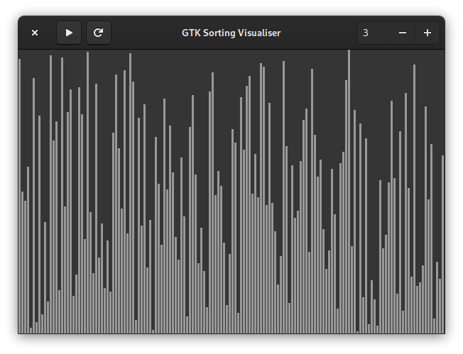

# gtk-sortvis
A GTK sorting visualiser

## Dependencies
* Python 3
* GTK3
* gobject-introspection
### Linux
All of the above should be already built into most Linux distros. If not, PyGObject is often packaged as `python3-gobject`, `python3-gi`, `pygobject` or as a dependency for `gobject-introspection`.
### macOS
Requires [Homebrew](https://brew.sh).

`brew install gtk+3 pygobject3`
### FreeBSD
`pkg install python gtk3 gobject-introspection`
### OpenBSD
`pkg_add python py-gobject3 gtk+3`

## Running
`python main.py`
or
`python3 main.py`

## Notes
### Quicksort
Quicksort only compares elements to the pivot it chose, not to one another, so it sometimes swaps two identical elements. If this happens too often, the visualisation seemingly stops. This program has a “quicksort fast mode”, which makes it skip the time.sleep() instructions and thus gets rid of the issue.

Quicksort also works on already sorted lists.

### Counting sort and radix sort with counting sort as its subroutine
The two are not comparison sorting algorithms, so they're intended to work on a new list rather than the original. This means that:
* I had to come up with a workaround to make the visualisation work (creating a copy instead of an empty list)
* they look much different than other algorithms
* they attempt to work even if the list is already sorted
* if you stop them midway through, the list will differ from the original not only order-wise, but also content-wise.
