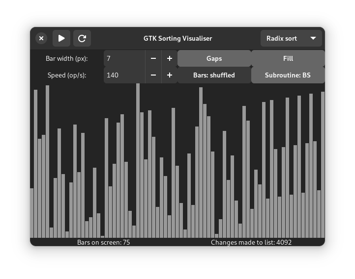

# gtk-sortvis
A sorting algorithm visualiser written in GTK. This program animates several sorting algorithms by showing the way they work on vertical bars.



## Dependencies
* Python 3
* GTK3
* gobject-introspection
* Adwaita icon theme

### Linux
All of the above should be already built into most Linux distros. If not, PyGObject is often packaged as `python3-gobject`, `python3-gi`, `pygobject` or as a dependency for `gobject-introspection`.

### macOS
Requires [Homebrew](https://brew.sh).

`brew install gtk+3 pygobject3 adwaita-icon-theme`

### Windows
Requires [MSYS2](https://msys2.org). Install MSYS2, run MSYS2 MinGW 64-bit.

```
pacman -Suy
pacman -S mingw-w64-x86_64-gtk3 mingw-w64-x86_64-python3 mingw-w64-x86_64-python3-gobject
```

### FreeBSD
`pkg install python gtk3 gobject-introspection`

### OpenBSD
`pkg_add python py-gobject3 gtk+3`

## Running
`./main.py`

## The interface
Most of the GUI elements have a tooltip.

After clicking the *start button* in the upper left corner, sorting begins. The *refresh button* stops it and reshuffles the bars. The *dropdown list* in the upper right corner lets you choose the algorithm and stops the sorting. In case radix sort is chosen, a toggle appears below, giving the user an option to pick the subroutine used by the algorithm – counting sort or bubble sort. Clicking said button also stops the sorting.

Options directly below the title bar determine the appearance of the bars.

The *speed spinner* controls the delay between each change made to the list being sorted. The bigger the value is, the shorter the delay is, thus making the operation run quicker. The *bar order toggle* determines the initial order of the bars – it may be random or sorted in descending order. It only takes effect if no sorting operation is in effect at the time or if the refresh button is clicked.

## Notes

### Counting sort and radix sort with counting sort as its subroutine
The two are not comparison sorting algorithms, so they're intended to work on a new, empty list rather than the original. This means they attempt to work even if the list is already sorted. If you stop them midway through, the list will differ from the original content-wise.
